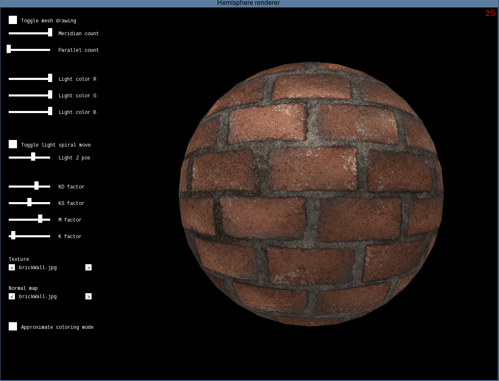
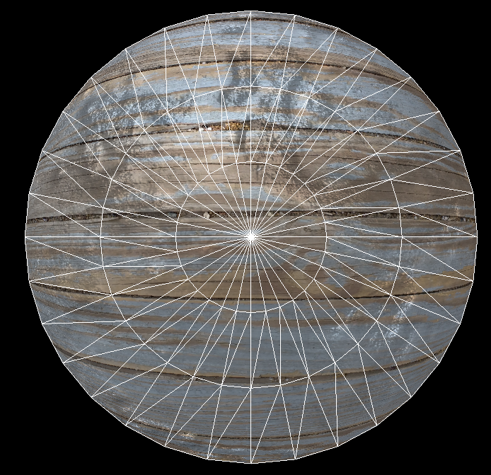
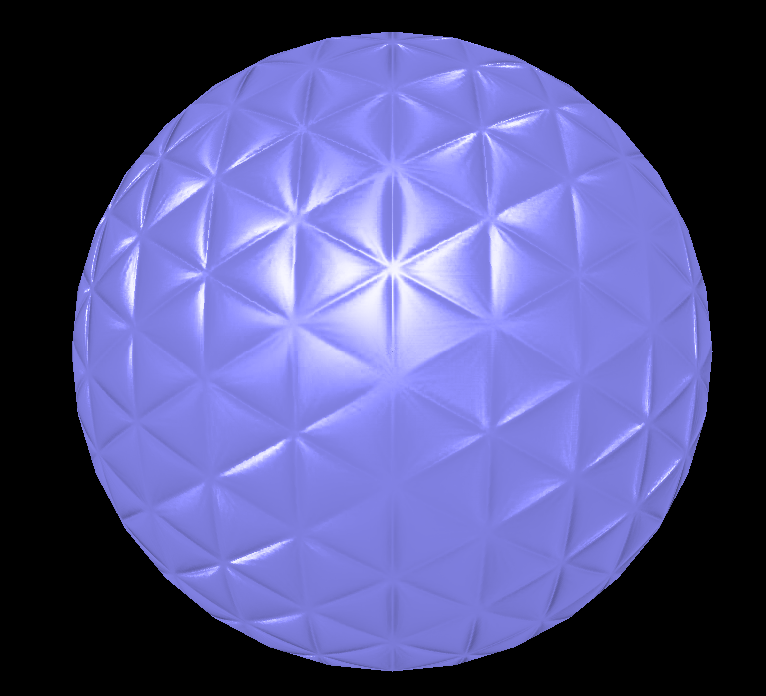
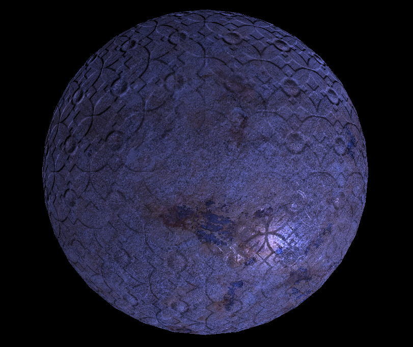

# Hemisphere renderer

## Description
Hemisphere renderer is a C++ project for a third year university subject Computer Graphics. This project explores many concepts related to computer graphics. It uses the scanline filling algorithm to fill triangle mesh with calculated pattern. The color of every pixel is calculated using chosen texture, normal map, current light position and color. The equation for pixels' colors was based on Phong reflection model. I also used CPU multithreading to increase the speed.

## Example screenshots

## Used resources
The font used in this project is Liberation Mono Regular.
Textures and normal maps can be found on https://3dtextures.me/ and https://www.photos-public-domain.com .
